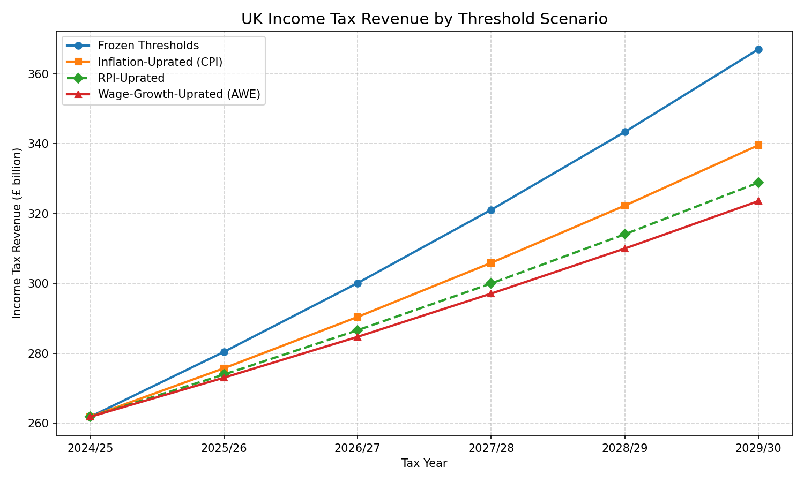
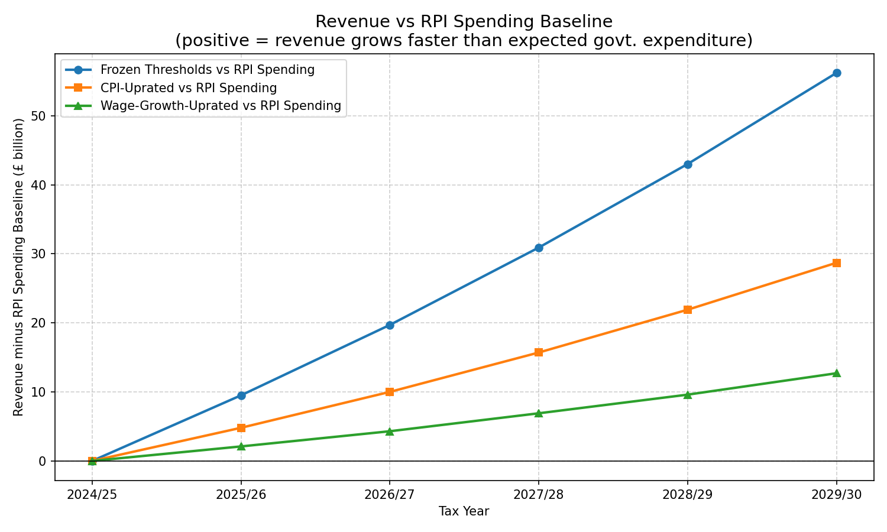

# UK Income Tax Threshold Analysis

A Python project that models how different income tax threshold policies affect government revenue in the UK over a five-year horizon (2025/26 – 2029/30).

## Overview

The UK personal allowance and basic/higher-rate limits have been frozen since 2021/22. As wages grow, more taxpayers are pulled into higher bands — a phenomenon known as **fiscal drag**. This project quantifies that effect by projecting revenue under four threshold-uprating scenarios and comparing each against an RPI spending baseline (a proxy for expected government expenditure growth).

## Scenarios

| Scenario | Description |
|---|---|
| **Frozen Thresholds** | Thresholds held at 2024/25 levels — generates maximum fiscal drag |
| **CPI-Uprated** | Thresholds rise annually with CPI inflation (Bank of England target: 2.5%) |
| **Wage-Growth-Uprated** | Thresholds rise annually with AWE wage growth (OBR forecast: 4.0%) |
| **RPI-Uprated** | Thresholds rise annually with RPI inflation (typically ~1 pp above CPI: 3.5%) |

An **RPI Spending Baseline** is also included: base-year revenue grown at the RPI rate, used as a proxy for expected government expenditure growth.

## Economic Assumptions (defaults)

| Parameter | Default | Source |
|---|---|---|
| Annual wage growth (AWE) | 4.0% | OBR central forecast |
| Annual CPI inflation | 2.5% | Bank of England target |
| Annual RPI inflation | 3.5% | Approx. 1 pp above CPI |
| Number of taxpayers | 34,700,000 | HMRC 2024 estimate |
| Base year | 2024/25 | — |

Income is modelled using a lognormal distribution calibrated to ONS ASHE 2024 data (median ≈ £35k, mean ≈ £42k).

## Charts

### Revenue by Threshold Scenario


### Revenue vs RPI Spending Baseline


## Requirements

- Python 3.11+
- [pandas](https://pandas.pydata.org/) ≥ 2.0
- [numpy](https://numpy.org/) ≥ 1.24
- [matplotlib](https://matplotlib.org/) ≥ 3.7
- [scipy](https://scipy.org/) ≥ 1.11
- [streamlit](https://streamlit.io/) ≥ 1.30

## Installation

```bash
pip install .
```

To include test dependencies:

```bash
pip install ".[test]"
```

## Usage

### Run the analysis script (CLI)

Prints revenue projections and fiscal-drag tables to stdout, and saves two PNG charts:

```bash
python -m tax_analysis.tax_analysis
```

Output files:
- `tax_revenue_scenarios.png` — revenue by threshold scenario
- `tax_revenue_vs_rpi.png` — revenue gap vs RPI spending baseline

### Launch the interactive dashboard

```bash
streamlit run dashboard.py
```

The dashboard lets you adjust the economic assumptions (wage growth, CPI, RPI) via sidebar sliders and see the revenue projections update in real time.

## Project Structure

```
tax-threshold-analysis/
├── tax_analysis/
│   ├── __init__.py
│   └── tax_analysis.py      # Core modelling logic
├── dashboard.py             # Streamlit interactive dashboard
├── tests/
│   └── test_tax_analysis.py # Unit tests
├── pyproject.toml
└── README.md
```

## Running Tests

```bash
pytest tests/
```

